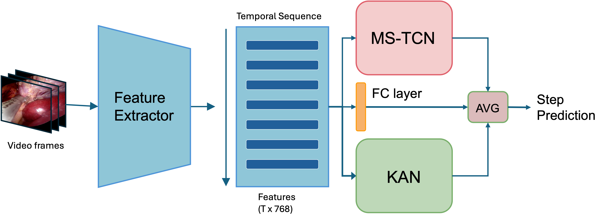

# MICCAI 2024 SurgVU Challenge

This repository contains the code for the **MICCAI 2024 SurgVU Challenge**. The goal is to train a Vision Transformer (ViT) as a feature extractor and a Multi-Stage Temporal Convolutional Network (MS-TCN) for surgical video understanding.

## Table of Contents

- [Pretrained Model Download](#pretrained-model-download)
- [Model Path Update](#model-path-update)
- [Preparing Data](#preparing-data)
- [Training Instructions](#training-instructions)
  - [1. Train Feature Extractor](#1-train-feature-extractor)
  - [2. Train MS-TCN](#2-train-ms-tcn)
- [Model Architecture](#model-architecture)
- [Conclusion](#conclusion)

---
## Model workflow


## Pretrained Model Download

To download the pretrained model required for this project, follow these steps:

1. Go to the [LoViT GitHub repository](https://github.com/MRUIL/LoViT).
2. Download the pretrained model from the releases section and save it to your desired location.

---

## Model Path Update

After downloading the pretrained model, update the `cnn.py` file to load the model correctly.

- Open `cnn.py` and locate the following line:
  ```python
  TIMM = torch.load('<path to the pretrained model>')

surgvu_challnege.txt should look like 
  frame                                 time   task   case
case_000_video_part_001/00000000.png   0.0    7     case_000
case_000_video_part_001/00000060.png   1.0    7     case_000


To train the feature extractor, run the following command:

```python
python train.py -c modules/cnn/config/config_feature_extract_single.yml \
    --exp_name backbone_vit \
    --task 'task' \
    --out_features 8 \
    --weight False \
    --min_epochs 1 \
    --max_epochs 1 \
    --model cnn.vit_base_patch16_224


```markdown
## Stage 2 Training Instructions

To train the stage 2, run the following command:

```python
python train.py -c modules/mstcn/config/config_tcn_single.yml \
    --exp_name ms_tcn_w_kan \
    --out_features 8 \
    --task 'task' \
    --weight False \
    --min_epochs 80 \
    --max_epochs 100 \
    --mstcn_stages 2 \
    --teacher_exp_name backbone_vit \
    --model mstcn.MultiStageModel_surgvu
